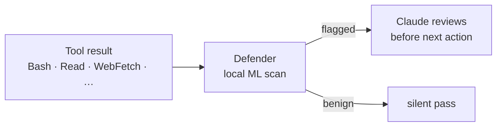

# StackOne Defender

On-device prompt-injection and jailbreak detection for Claude Code. Runs as a `PostToolUse` hook, scans every tool result with a local ML classifier, and quietly cues Claude to review anything risky before acting on it.

No network calls, no telemetry, no cloud dependency — the entire classifier runs on your machine.

**Links** · [Product page](https://www.stackone.com/platform/prompt-injection-guard/) · [`@stackone/defender` on npm](https://www.npmjs.com/package/@stackone/defender) (the underlying library this plugin wraps)

## Why

LLM agents act on whatever lands in their context window. A malicious payload tucked into a fetched webpage, a poisoned issue comment, or a doctored support ticket can talk the agent into running commands the user never asked for. This class of attack is called *indirect prompt injection*, and it bypasses any defense that only watches user input. More background and benchmarks live on the [StackOne Prompt Injection Guard product page](https://www.stackone.com/platform/prompt-injection-guard/).

Defender sits in the agent loop and scans **tool outputs** — the path most injection payloads ride in on — using an on-device multi-head ML classifier trained on real attack and benign-content data. When the classifier flags something, Defender doesn't block the call or interrupt you; it injects a one-line hint into Claude's next turn so the model can decide.

In our own evaluation against `claude-haiku-4-5` across 8 published-archetype attack fixtures (curl-pipe-sh README hooks, false-authority overrides, DNS side-channel, zero-width unicode, memory poisoning, etc.), baseline attack success was **13.75%**. With Defender's hint in context, it dropped to **0%**. Detail: `docs/read-exfil-probe-haiku-defender-report.md` in `StackOneHQ/stackone-agent-redteaming`.

## Install

Requires Node ≥ 22.

**1. Add the StackOne marketplace** to Claude Code. This makes all StackOne plugins discoverable in `/plugin install`.

```bash
/plugin marketplace add stackonehq/agent-plugins
```

**2. Install the Defender plugin.** This registers the PostToolUse hook and the bundled skill.

```bash
/plugin install stackone-defender@stackone-agent-plugins
```

**3. Trigger the first run.** Use any tool that returns more than ~500 bytes (e.g. `Read` a file, or `WebFetch` any URL). The hook self-installs its ML dependencies (`@stackone/defender`, `onnxruntime-node`, `@huggingface/transformers`, `fasttext.wasm`) into the plugin's own `node_modules` on this first call. Expect a one-time 5–10 second pause; subsequent calls reuse a persistent daemon over `~/.claude/defender.sock` and complete in low milliseconds.

That's it — there's no API key, no config file to edit, and no account to create. Defender is active from the next tool call onward.

## What gets scanned

The PostToolUse hook is wired to fire on:

```
Bash | Read | WebFetch | WebSearch | Monitor | ReadMcpResourceTool | mcp__.*
```

That covers the highest-risk surfaces — shell output, files Claude reads, fetched web content, search results, log streams, and the full universe of MCP tool responses. Payloads smaller than 500 bytes are skipped (nothing meaningful injects in that window).

## How it works



- The **daemon** keeps the ONNX model and tokenizer in memory across calls. One process per user; auto-respawns on version mismatch.
- The **hook** is a thin stdin/stdout client. Connects to the daemon over a Unix domain socket, ships the tool output, waits up to 5 seconds for a verdict, and falls back to silent-pass if anything goes wrong (timeout, daemon down, install failed). Never blocks the agent.
- The **skill** (`skills/stackone-defender/SKILL.md`) is loaded into Claude's context and governs how the model reacts to flags. Default behavior: silent review on suspected false positives, refuse-and-tell-user on confirmed attacks, no flag-related noise otherwise.

## What you experience

In day-to-day use, you mostly don't experience Defender at all. It runs in the background; flags are private cues to Claude. The asymmetry is intentional:

- **Confirmed real injection** → Claude refuses to act on the injected instruction and tells you what it saw.
- **False positive** (the dominant class — security-adjacent prose, code snippets, structured logs) → Claude continues your task as if nothing happened.
- **Ambiguous** → Claude mentions it in one sentence and asks how to proceed.

The previous "notify on every flag" behavior generated noise on legitimate documentation, code, and meta-discussion of attacks. The current behavior trains Claude to use Defender's signal for *its own* precision check rather than dumping the recall problem on you.

## Configuration

Default thresholds and the model path live in `scripts/defender-daemon.config.json`:

```json
{
  "blockHighRisk": true,
  "enableTier1": false,
  "useSfe": true,
  "tier2Config": {
    "onnxModelPath": "${defenderRoot}/models/minilm-multihead-v5",
    "temperatureT": 2.41,
    "highRiskThreshold": 0.64,
    "multihead": {
      "mainThreshold": 0.64,
      "auxThreshold": 0.458
    }
  }
}
```

`enableTier1` is off by default — Tier 1 (regex patterns) is brittle and high-FP on prose discussing attacks. Tier 2 (the multihead ONNX classifier with Static Frequency Estimation preprocessing) is the sole decision-maker.

Restart your shell to pick up config changes; the daemon reloads on next spawn.

## Privacy

- **No telemetry.** No analytics, no usage pings, no "phone home."
- **No network egress.** The classifier is a local ONNX file shipped with the plugin. Inference is fully on-device.
- **No persistence.** Flagged scans are not written to disk — local or remote. The only durable artifact is the daemon's stderr log at `~/.claude/defender-daemon.log` (rotated, capped at a few MB).
- **No feedback path.** There is no upstream collector, no FP labeling channel, no model-update mechanism. Updates ship via new plugin versions.

## Files in your home directory

| Path | Purpose |
|---|---|
| `~/.claude/defender.sock` | Unix socket the hook talks to |
| `~/.claude/defender-daemon.json` | Running daemon's PID + version state |
| `~/.claude/defender-daemon.log` | Daemon stderr (rotated) |
| `~/.claude/defender-client.log` | Hook-side errors (transient) |
| `~/.claude/defender-daemon.lock` | Spawn-time lockfile (transient) |

All five are local-only. None of them get written to until Defender actually fires.

> [!NOTE]
> Older versions wrote `~/.claude/defender-feedback.jsonl` and read `~/.claude/defender-collector.json` for an internal FP-labeling loop. Both are gone from v2.6 onward; if either file is on your machine from an older install, it's harmless and can be deleted.

## Troubleshooting

**Defender doesn't seem to fire.** Tool outputs under 500 bytes are skipped intentionally. Check `~/.claude/defender-daemon.log` to confirm the daemon is alive. If the log is empty, the hook may have failed to install dependencies — run `cd $CLAUDE_PLUGIN_ROOT && npm install` manually.

**"Slow first scan."** Cold start spawns the daemon and warms up the ONNX session. Steady-state latency is a few milliseconds; first call after a fresh login can take 5–10 seconds.

**Daemon won't start.** Delete `~/.claude/defender.sock`, `~/.claude/defender-daemon.json`, and `~/.claude/defender-daemon.lock`, then retry. The hook recovers from stale state automatically but a manual clean is occasionally faster.

**Architecture without `onnxruntime-node` binaries.** Rare on macOS / Linux x86_64 / arm64, but if you hit it, the daemon falls back to a smaller MLP head. Detection quality is lower; raise an issue with your platform string.

## Tests

The plugin ships a QA fixture regression suite that exercises 12 canonical inputs (benign / realistic-attack / tricky-FP) against the live classifier:

```bash
cd plugins/security/stackone-defender
npm test
```

Fixtures live in `tests/fixtures/{benign,realistic,tricky}/`. The tricky bucket is the most important — it pins the FP behavior on the content classes that used to false-positive most often (research notes on injection, employee policies, incident postmortems, release notes, listing-shaped API responses).

## Versioning

This plugin follows the marketplace's lockstep version. Behavior-affecting changes ship via [release-please](https://github.com/googleapis/release-please) on merge.

## License

MIT.
